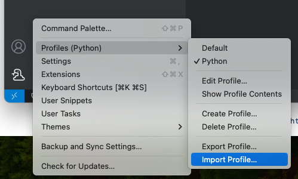

## VSCode 
This repo contains some config files that help easily recreate specific VSCode dev environments.

## Python Setup

**Theme**: [PyCharm Dark](https://marketplace.visualstudio.com/items?itemName=nicohlr.pycharm)

**Extensions**:
- [autoDocstring](https://marketplace.visualstudio.com/items?itemName=njpwerner.autodocstring)
- [Black Formatter](https://marketplace.visualstudio.com/items?itemName=ms-python.black-formatter)
- [Django](https://marketplace.visualstudio.com/items?itemName=batisteo.vscode-django)
- [isort](https://marketplace.visualstudio.com/items?itemName=ms-python.isort)
- [json](https://marketplace.visualstudio.com/items?itemName=ZainChen.json)
- [Pylance](https://marketplace.visualstudio.com/items?itemName=ms-python.vscode-pylance)
- [Python](https://marketplace.visualstudio.com/items?itemName=ms-python.python)
- [Python Indent](https://marketplace.visualstudio.com/items?itemName=KevinRose.vsc-python-indent)
- [Remote - SSH](https://marketplace.visualstudio.com/items?itemName=ms-vscode-remote.remote-ssh)
- [Dev Containers](https://marketplace.visualstudio.com/items?itemName=ms-vscode-remote.remote-containers)

To use the Python profile:

1. Clone the repo
2. Import the `Python.code-profile` file into VSCode
  

